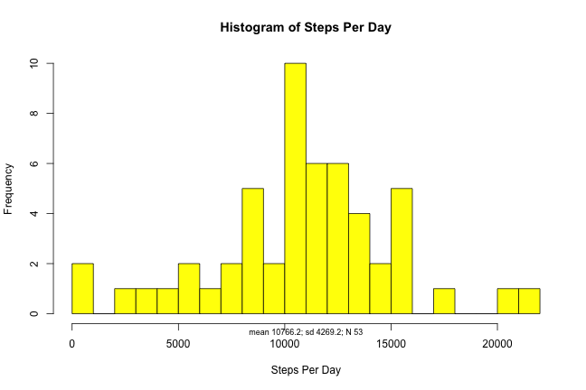
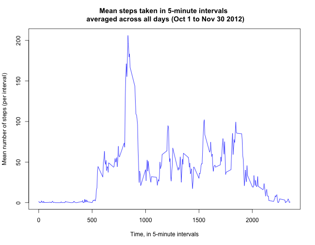
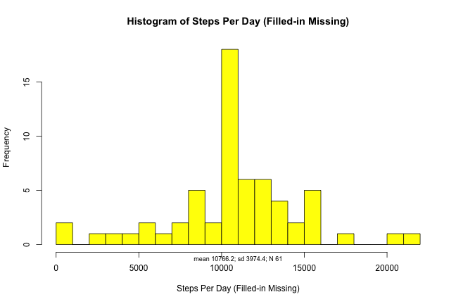
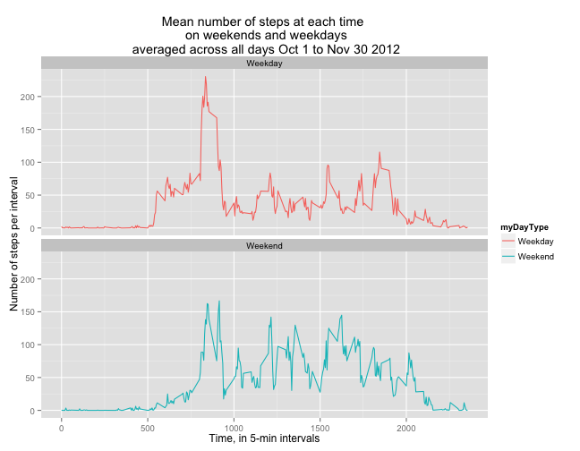

My Peer Assessment 1 for Reproducible Research
============================


## Loading and pre-processing data  

Set working directory with "setwd" command.


### *1. Load the data*
Load the data from saved csv file on computer. I call it **myData**.


```r
myData <- read.csv(file="activity.csv",header=T,sep=",")
```

```
## Warning in file(file, "rt"): cannot open file 'activity.csv': No such file
## or directory
```

```
## Error in file(file, "rt"): cannot open the connection
```
Here is a summary of these data:

```r
summary(myData)
```

```
##      steps             date               interval     
##  Min.   :  0.00   Min.   :2012-10-01   Min.   :   0.0  
##  1st Qu.:  0.00   1st Qu.:2012-10-16   1st Qu.: 588.8  
##  Median :  0.00   Median :2012-10-31   Median :1177.5  
##  Mean   : 37.38   Mean   :2012-10-31   Mean   :1177.5  
##  3rd Qu.: 12.00   3rd Qu.:2012-11-15   3rd Qu.:1766.2  
##  Max.   :806.00   Max.   :2012-11-30   Max.   :2355.0  
##  NA's   :2304
```

There are three variables: **steps**, **interval**, and **date**.  

Here is the way **date** is formatted now:


```r
class (myData$date)
```

```
## [1] "Date"
```

```r
head (as.character (myData$date))
```

```
## [1] "2012-10-01" "2012-10-01" "2012-10-01" "2012-10-01" "2012-10-01"
## [6] "2012-10-01"
```

### *2. Process the data*
**Date** needs to be classed as a date variable.  


```r
library(lubridate)
myData$date <- as.Date( as.character(myData$date), format = "%Y-%m-%d")
```

## What is mean total number of steps taken per day?

Make a new variable that is steps aggregated by day.


```r
stepsPerDay <- aggregate(steps ~ date, data=myData, FUN=sum)
```

### *1. Histogram of steps*
This histogram shows the distribution of how many steps per day study participants took.

```r
hist (stepsPerDay$steps, 
      col = "yellow" , 
      breaks=20 , 
      main = "Histogram of Steps Per Day", xlab = "Steps Per Day")
        mtext(paste("mean ", round(mean(stepsPerDay$steps , na.rm=T),1)
                    , "; sd ", round(sd(stepsPerDay$steps , na.rm=T),1)
                    , "; N ", sum (complete.cases (stepsPerDay)),sep="")
              , side=1, cex=.75)
```

 

### *2. Calculate mean and median steps per day*


```r
options(scipen = 999)
myMean <-  round (mean (stepsPerDay$steps, na.rm=TRUE), 2)
myMedian <- median (stepsPerDay$steps, na.rm=TRUE)

#write out answer
line1 <- paste (
        "MEAN:"
        , myMean
       )
line2 <- paste (
        "MEDIAN:"
        , myMedian
       )
print (c(line1,line2))
```

```
## [1] "MEAN: 10766.19" "MEDIAN: 10765"
```

## Average Daily Activity Pattern

### *1. Time series plot*

Data was collected at 5-min intervals. 

```r
stepsPerInterval <- aggregate(steps ~ interval, data=myData, FUN=mean)

plot(stepsPerInterval$steps ~ stepsPerInterval$interval
     , type="l"
     , ylab="Mean number of steps (per interval)"
     , xlab="Time, in 5-minute intervals"
     , col="blue"
     , main = paste("Mean steps taken in 5-minute intervals", "\n",
                            "averaged across all days (Oct 1 to Nov 30 2012)"))
```

 

### *2. Which interval has maximum steps?*
In dataframe **stepsPerInterval**, each row is a 5-min time interval. Determine which row (time interval) has the highest value for average steps in that interval averaged across all days (column **steps**). 


```r
myMaxLine <- which.max (stepsPerInterval$steps)
myMaxSteps <- stepsPerInterval[myMaxLine,]$steps
myMaxInterval <- stepsPerInterval[myMaxLine,]$interval

#write out answer:
line1 <- paste (
        "ANSWER: The maximum number of steps occur at 5-min interval"
        , myMaxInterval
        , "(located at row #"
        , myMaxLine
        , "in the dataset)"
       )
line2 <- paste ("at which point there are on average of"
        , round (myMaxSteps, 3)
        , "steps across the days in the dataset."
       )
print (c(line1,line2))
```

```
## [1] "ANSWER: The maximum number of steps occur at 5-min interval 835 (located at row # 104 in the dataset)"
## [2] "at which point there are on average of 206.17 steps across the days in the dataset."
```

## Imputing Missing Values

### *1. Total number of missing values*
Calculate and report the total number of missing values in myData (i.e. the total number of rows with NAs).

```r
myMissing <- sum (!complete.cases(myData))

#write out answer:
paste ("There are a total of", myMissing, "rows with NAs in the dataset.")
```

```
## [1] "There are a total of 2304 rows with NAs in the dataset."
```

### *2. Fill in all of the missing values in the dataset*
For intervals with some but not all missing values, my strategy is to use the mean of the non-missing values for that interval. 


```r
# create empty dataset called newData.
# we will fill in newData with the non-missing values and the new computed values
newData <- data.frame(steps=NA, interval=NA, date=NA)
newData <- as.data.frame (matrix (newData, nrow=length(myData$steps)))

#for loop through each row of myData
for (i in 1:nrow(myData)) {
    if(is.na(myData$steps[i])) { # identify rows with missing values
        newSteps <- stepsPerInterval$steps[which( 
                stepsPerInterval$interval == myData$interval[i] 
                )] # replace missing values with mean of interval
        # use this computed value as "steps", which was missing before
        newData$steps[i] <- newSteps 
        # attached this new "steps" value to corresponding interval
        newData$interval[i] <- myData$interval[i]
        # attached this new "steps" value to corresponding date
        newData$date[i] <- myData$date[i]
    } else { # if the "steps" value isn't missing, use original data:
            newData$steps[i] <- myData$steps[i]
            newData$interval[i] <- myData$interval[i]
            newData$date[i] <- myData$date[i]
    }
}
```

The new dataset is called **newData**.

### *3. Histogram of data with filled-in missing values*
Make a new variable that is steps aggregated by day, with missing values filled in with interval means.

```r
newStepsPerDay <- aggregate(steps ~ date, data=newData, FUN=sum)
```

This histogram shows the distribution of how many steps per day study participants took, with missing values filled in with interval means.  
*Notice the sample size (N) is greater because of filled-in missingness*

```r
hist (newStepsPerDay$steps, 
      col = "yellow" , 
      breaks=20 , 
      main = "Histogram of Steps Per Day (Filled-in Missing)", xlab = "Steps Per Day (Filled-in Missing)")
        mtext(paste("mean ", round(mean(newStepsPerDay$steps, na.rm=T),1)
                    , "; sd ", round(sd(newStepsPerDay$steps , na.rm=T),1)
                    , "; N ", sum (complete.cases (newStepsPerDay)),sep="")
              , side=1, cex=.75)
```

 


```r
options(scipen = 999)
myMean2 <-  round (mean (newStepsPerDay$steps, na.rm=TRUE), 2)
myMedian2 <- round (median (newStepsPerDay$steps, na.rm=TRUE), 2)

#write out answer
line1 <- paste (
        "NEW MEAN:"
        , myMean2
       )
line2 <- paste (
        "NEW MEDIAN:"
        , myMedian2
       )
print (c(line1,line2))
```

```
## [1] "NEW MEAN: 10766.19"   "NEW MEDIAN: 10766.19"
```

Do these values differ from the estimates from the first part of the assignment? 
```
Mean: No difference.
Median: Changed very slightly, from 10765 to 10766.19. 
Now, the median is the same as the mean.
```

What is the impact of imputing missing data on the estimates of the total daily number of steps?
```
The impact is minor. The mean is unchanged. The standard deviation shrunk a bit (SD changed from 4269.2 to 3974.4).
```

## Differences in activity patterns between weekdays and weekends
Use the dataset with the filled-in missing values, called **newData**.

### *1. Create a new factor variable for weekday and weekend*
Give this new variable two levels: *weekday* and *weekend*.
Firstly, change class of **date** in **newData**, because this was lost in creation of dataset.

```r
class (newData$date) <- "Date"
```

Secondly, add a variable into **newData** that says whether the date is a weekend or weekday.

```r
newData$wd <- weekdays(newData$date)
newData$myDayType <- NULL
for (i in 1:length(newData$wd)) {
    if (newData$wd[i]=="Saturday" || newData$wd[i] == "Sunday") {
        newData$myDayType[i] <- 'Weekend'
    } else {
            newData$myDayType[i] <- 'Weekday'
            }
    }
```

### *2. Panel plot by weekday versus weekend*

First, make a new variable that is steps aggregated by *both* day and day type (i.e., weekday versus weekend).


```r
wdStepsPerDay <- aggregate(steps ~ interval + myDayType, newData, FUN=mean)
```

Next, make a panel plot containing a time series plot (i.e. type = "l") of the 5-minute interval (x-axis) and the average number of steps taken, averaged across all weekday days or weekend days (y-axis).

```r
library(ggplot2)

qplot(interval, steps, data=wdStepsPerDay, color=myDayType
      , geom=c("line"), xlab="Time, in 5-min intervals"
      , ylab="Number of steps per interval"
      , main="Mean number of steps at each time \n on weekends and weekdays\n averaged across all days Oct 1 to Nov 30 2012") + 
        facet_wrap(~ myDayType, ncol=1)
```

 

Are there differences in activity patterns between weekdays and weekends?
```
Yes, steps-per-time are more consistenty high for a larger portion of weekends, whereas weekdays have a more extreme peak compared to the rest of the days. Additionally, activity begins earlier in the day on weekdays compared with weekends.
```
